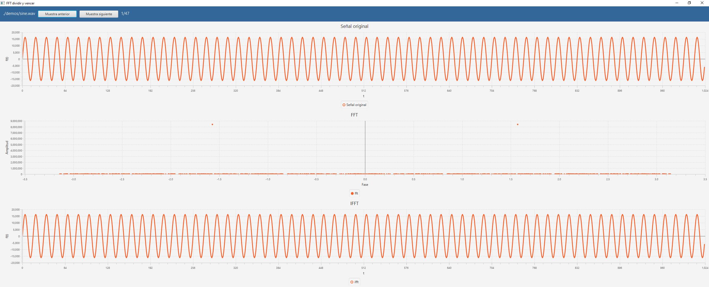
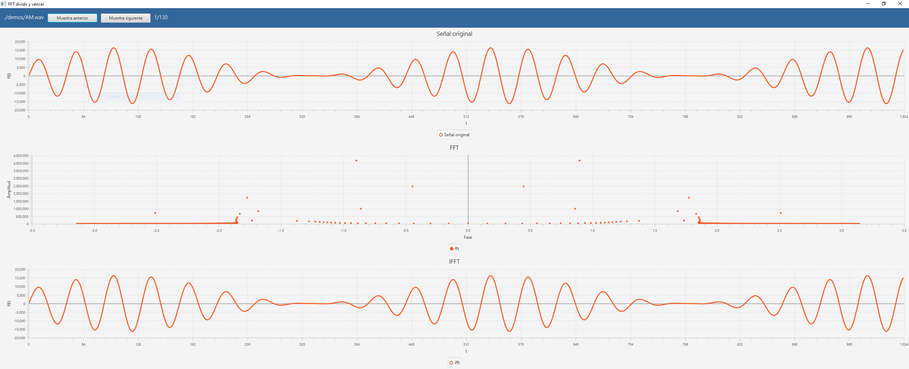
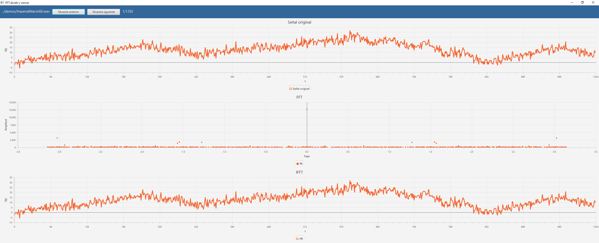

# FourierJavaFX
Este proyecto en Java calcula la FFT y IFFT de un archivo WAV, graficando el proceso utilizando JavaFX, el nombre del archivo se especifica por línea de comandos. El archivo resultante se almacena en la misma carpeta del archivo original y se le concatena la palabra "SALIDA". El programa procesa 1024 muestras a la vez, y a través de la interfaz se puede cambiar el conjunto de muestras a visualizar en pantalla.\
Los puntos complejos a + b*i de la fft se grafican utilizando la amplitud y la fase con la formula x = sqt(a^2 + b^2) y = atan2(b/a).

## Compilación y ejecución
Para poder ejecutar el proyecto se debe de contar con maven instalado y JDK 8+.\
Para compilar se ejecuta el siguiente comando en una terminal:\
`mvn clean compile`\
Para ejecutar el programa:\
`mvn exec:java -Dexec.mainClass="com.cic.analisisdealgoritmos.App" -Dexec.args="ruta del archivo"`\
Un ejemplo de ejecución seria: \
`mvn exec:java -Dexec.mainClass="com.cic.analisisdealgoritmos.App" -Dexec.args="./demos/AM.wav"`

## Capturas de pantalla
### Archivo sine.wav

### Archivo AM.wav

### Archivo ImperialMarch60.wav

## Video

  

